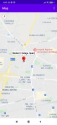
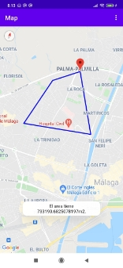
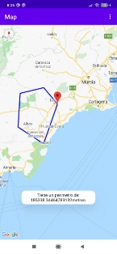
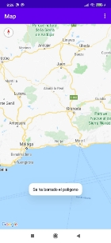

# Mapas
En esta aplicación he implantado Google Maps en nuestra aplicación.

1. Lo primero que he hecho es instalar en su entorno Los Google Play Service.
1. Luego me he dirigido a Google Cloud Platfom, y dentro de las api selecciono Maps SDK for Android, la habilito, creo la Apikey y la restrinjo la clave la copia.
1. En Android Studio, creamos un proyecto nuevo  y seleccionamos un Google Maps activity, automáticamente nos crea **res/values/google\_maps\_api.xml** , y le añadimos  nuestra Apikey, y esto hace que automáticamente nos incluya los permisos en el Manifest.
1. Implementamos las dependencias necesarias para nuestro proyecto, para los mapas:**'com.google.android.gms:play-services-maps:17.0.0',**y para las librerías que vamos a utilizar para calcular el perímetro  y el área: **'com.google.maps.android:android-maps-utils:2.1.0'.**
1. La Actividad que  creas por defecto tiene implantado OnMapReadyCallback, que lo que hace es que por defecto que coloca el marker, en Sydney , yo lo que he hecho es poner el punto por defecto en málaga :

1. Para el vértice principal  creamos un marker nuevo y acercamos la cámara ademas acercamos la cámara y con los clics cortos el resto de  vértices ,pasando las coordenadas de estos a una lista de coordenadas,dibujamos lineas entre ellos ,Y cuando en el menú clickamos metroCuatrados, cerramos el polígono dibujado con la polilineas y ,utilizamos  la Clase  SphericalUtil y utilizamos su método computeArea y los datos que le pasamos lista de coordenadas para el cálculo de la área:

1. Para el vértice principal  creamos un marker nuevo y acercamos la cámara ademas acercamos la cámara y con los clics cortos el resto de  vértices ,pasando las coordenadas de estos a una lista de coordenadas,dibujamos lineas entre ellos ,Y cuando en el menú clickamos  perímetro, utilizamos su método computeLenght() y le pasamos los datos que le pasamos lista de coordenadas para el cálculo de la longitud:

1. Por último, cuando clickamos  en el menú  Borrar, limpiamos el mapa y la lista de coordenadas, mmap.clear() y  lista.clean() y reiniciamos las variables utilizadas tanto para el cálculo de los metros cuadrados y la longitud:

